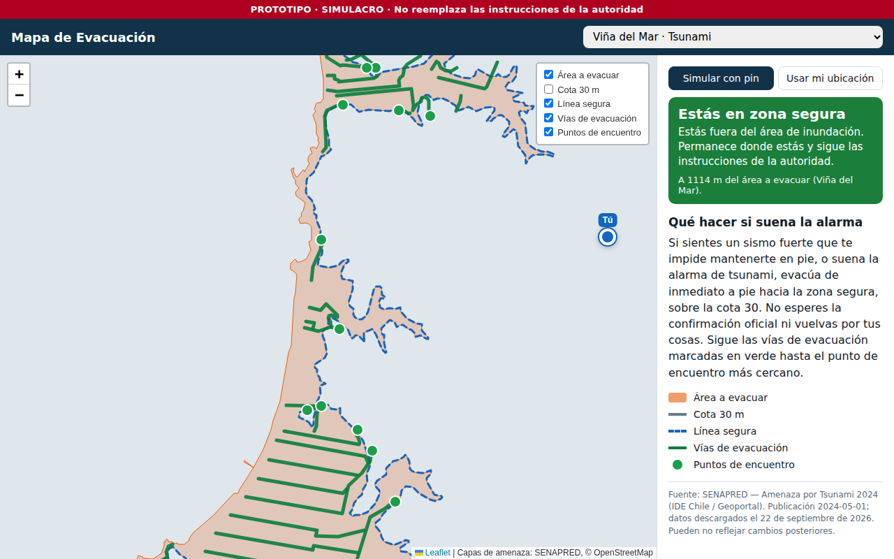
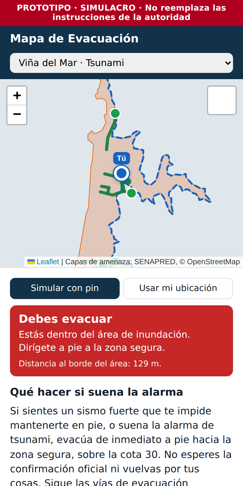

# Reporte 01 — Datos oficiales y diagnóstico de exposición

**Fecha:** 22 de septiembre de 2026 · **Etapas:** 1 (Datos) y 2 (Diagnóstico) · **Estado:** completas

App publicada: https://julianureta7-collab.github.io/mapa-evacuacion/

## Qué se hizo

**Etapa 1: datos oficiales en el mapa.** La app descarga las capas de *Amenaza por Tsunami 2024* de SENAPRED desde su servicio público y las muestra sobre un mapa de OpenStreetMap. Las capas son: área a evacuar, línea segura, vías de evacuación, puntos de encuentro y cota 30. Las capas se descargan una sola vez y quedan guardadas como archivos dentro de la app. Durante una emergencia no se consulta ningún servidor externo para obtenerlas.

**Etapa 2: diagnóstico.** Dada una posición, la app responde una pregunta: *¿esta persona tiene que evacuar?* La posición puede venir del GPS del teléfono o de un pin de simulación que se arrastra por el mapa. El resultado aparece al instante con un color:

| Estado | Condición | Color |
| --- | --- | --- |
| Debes evacuar | Dentro del área a evacuar | Rojo |
| Cerca del límite | Fuera, pero a menos de 100 m del borde (o a menos que el error del GPS) | Naranjo |
| Zona segura | Fuera del área y lejos del borde | Verde |
| Sin ubicación | GPS denegado o sin señal | Gris |

## Datos descargados (Viña del Mar y alrededores)

| Capa | Elementos | Tamaño |
| --- | --- | --- |
| Puntos de encuentro | 34 (25 Viña del Mar, 7 Valparaíso, 2 Concón) | 11 KB |
| Vías de evacuación | 74 tramos | 47 KB |
| Línea segura | 6 | 141 KB |
| Área a evacuar | 3 polígonos (Viña del Mar, Valparaíso, Concón) | 252 KB |
| Cota 30 m | 2 | 39 KB |
| **Total** | | **≈ 490 KB** |

Fuente: SENAPRED, publicado en el Geoportal de Chile (IDE Chile), fecha de publicación 2024-05-01. La fecha de descarga se muestra en la app.

## Decisiones técnicas (útiles para el informe)

- **Todo se calcula en el teléfono.** La ubicación del usuario nunca se envía a un servidor. Es una decisión de privacidad y también de robustez: el diagnóstico funciona aunque la red esté caída.
- **Sin frameworks ni herramientas de compilación.** La app es HTML y JavaScript simples, con las librerías Leaflet (mapa) y Turf (geometría) incluidas en el propio proyecto. Esto facilita que funcione sin conexión más adelante (etapa 6).
- **Optimización del cálculo.** El polígono de Viña del Mar tiene unos 4.900 vértices. Calcular la distancia al borde con la librería estándar tardaba ~50 ms, lo que se siente trabado al arrastrar el pin en un celular. Se reemplazó por un cálculo propio con proyección plana local (error < 0,5 % a escala de ciudad), que tarda < 1 ms con los mismos resultados (±1 m).
- **El GPS tiene error, y cerca del borde eso importa.** Si el margen de error del GPS es mayor que la distancia al borde, la app no puede saber de qué lado está la persona y la clasifica como "cerca del límite", es decir, le dice que evacúe igual. Si el error supera 50 m, lo advierte en pantalla.
- **Hosting gratuito con HTTPS.** GitHub Pages publica la app automáticamente en cada cambio. El HTTPS es obligatorio para que el navegador entregue la ubicación.

## Limitaciones conocidas

- Los puntos de encuentro de SENAPRED no traen nombre (`nombre_pe` vacío), solo un código como `05109PE021`.
- Un punto en el mar aparece como "zona segura", porque el polígono solo cubre tierra. No afecta el uso real.
- Los datos pueden estar desactualizados respecto de los planes municipales vigentes. La app lo advierte.
- El escenario del campus aún no tiene datos: faltan las zonas de seguridad (levantamiento pendiente).

## Siguiente etapa

**Etapa 3: ruta.** Elegir el punto de encuentro adecuado y trazar la ruta a pie hasta él, verificando que la ruta salga del área de inundación y no vuelva a entrar. Requiere la clave de OpenRouteService.
