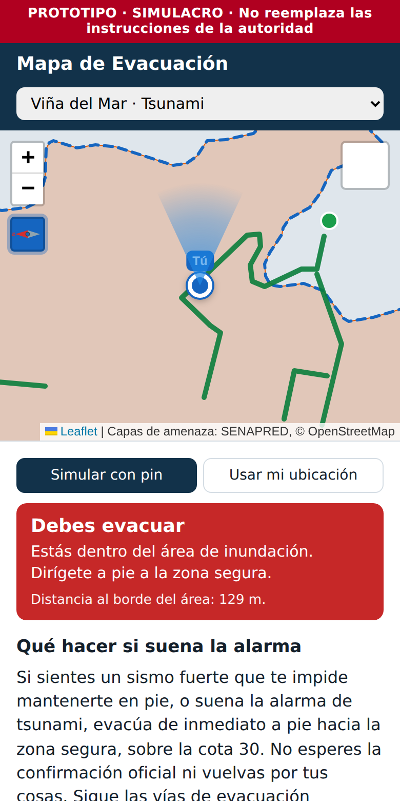
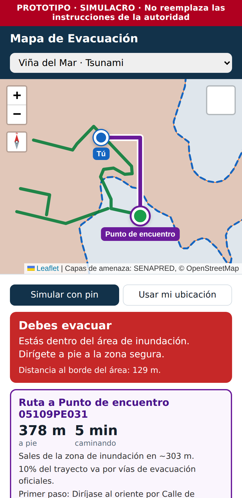
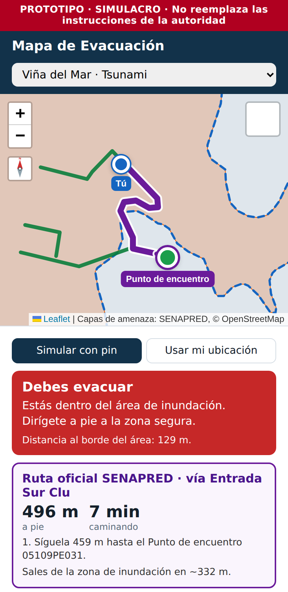
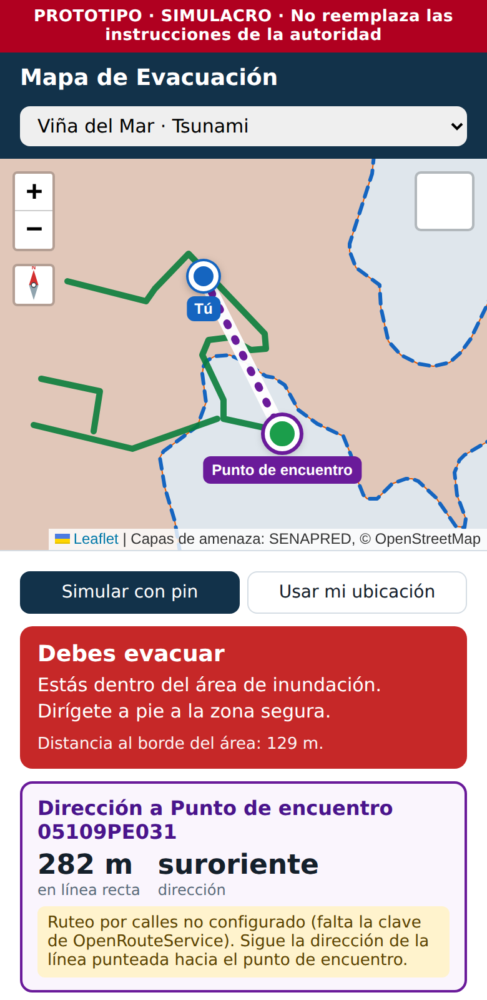

# Reporte 02 — Brújula y cálculo de rutas

**Fecha:** 25 de septiembre de 2026 · **Etapa:** 3 (Ruta) + brújula · **Estado:** completa (falta probar con la clave real de OpenRouteService)

## Brújula con efecto linterna

Un botón bajo el zoom alterna entre dos modos:

- **Norte arriba:** el mapa queda fijo, como un mapa de papel.
- **Brújula:** el mapa gira para que lo que la persona tiene al frente quede arriba, y un cono de luz sale desde su posición hacia donde apunta el teléfono.

Se validó en iPhone. En iPhone la primera vez hay que aceptar el permiso de orientación. En un computador sin brújula, la app lo detecta a los 3 segundos y vuelve a norte arriba.

## Ruta de evacuación

Cuando la persona debe evacuar (o está cerca del límite), la app elige un punto de encuentro y dibuja la ruta a pie.

**Método de respaldo (ruta por calles). Cómo se elige el destino:**

1. Se consideran los puntos de encuentro oficiales a menos de 3 km, descartando los que están dentro del área de inundación.
2. Se piden rutas a pie reales, por calles, a los 3 más cercanos (servicio OpenRouteService).
3. **Regla "sale y no vuelve a entrar":** si una ruta sale de la zona de inundación y después vuelve a entrar, se descarta. Esto evita rutas que, por ejemplo, bordean la costa.
4. Entre las rutas válidas gana la que **saca antes a la persona de la zona de inundación**: la que recorre menos metros dentro del área. Si empatan, gana la más rápida.

**Qué muestra la app:** la distancia y el tiempo a pie, en cuántos metros se sale de la zona, qué porcentaje del trayecto va por vías de evacuación oficiales de SENAPRED, y la primera instrucción ("Diríjase al oriente por…").

## Actualización: rutas sobre las vías oficiales de SENAPRED

Al analizar la capa de vías de evacuación se encontró que **las 74 vías están dibujadas en el sentido de la evacuación**: todas empiezan dentro del área de inundación y 59 terminan fuera de ella. No forman una red conectada (solo 4 se tocan entre sí), sino corredores independientes que van de la costa a la zona segura, y 19 terminan junto a un punto de encuentro.

Con eso, el **método principal** pasó a ser:

1. Buscar la vía oficial que más conviene tomar (a menos de 500 m). El costo es el acercamiento a pie, con un factor 1,4 por el desvío entre cuadras, más lo que queda de vía hasta su final.
2. Trazar el acercamiento hasta la vía: en línea recta si son menos de 60 m, o por calles con OpenRouteService.
3. Seguir la vía oficial **tal como la publicó SENAPRED**, desde el punto de entrada hasta su final.
4. Si la vía termina a menos de 150 m de un punto de encuentro, unirla hasta él.

La ruta por calles a un punto de encuentro (descrita arriba) queda como **respaldo** para cuando no hay ninguna vía oficial cerca.

**Cobertura medida** sobre una grilla de 495 puntos cada 150 m dentro del área de inundación de Viña del Mar:

| Resultado | Puntos | % |
| --- | --- | --- |
| Ruta por vía oficial SENAPRED | 382 | 77 % |
| Sin vía oficial a menos de 500 m → ruta por calles (o línea recta sin servicio) | 83 | 17 % |
| Sin vía ni punto de encuentro cercano | 30 | 6 % |

En las rutas por vía oficial, el acercamiento hasta la vía tiene una mediana de 199 m (90 % bajo 414 m), y el tiempo total a pie una mediana de 7,6 minutos (90 % bajo 18,5 min). El cálculo tarda ~1,3 ms en el teléfono y **no necesita internet** salvo para el tramo de acercamiento por calles.

Esto es un argumento fuerte para la presentación: el sistema no inventa rutas, guía a la persona hasta la vía que definió el municipio y la hace seguirla.

## Qué pasa si falla el servicio de rutas

En una emergencia real la red puede saturarse. Si el servicio de rutas no responde, alcanza su límite de consultas o no está configurado, la app **no se queda en blanco**. Muestra una línea punteada en línea recta al punto de encuentro más cercano, con la distancia y la dirección ("hacia el suroriente"), y explica por qué no hay ruta por calles.

## Decisiones técnicas (para el informe)

- **Por qué no se usa la opción "evitar polígono" del servicio de rutas:** la persona que debe evacuar ya está dentro del polígono a evitar, y en ese caso el servicio no encuentra ninguna ruta. La seguridad de la ruta se valida después, en el teléfono, con la regla "sale y no vuelve a entrar".
- **Cuidado con el límite de consultas:** el plan gratuito permite ~40 consultas por minuto. Mientras se arrastra el pin no se consulta nada, solo al soltarlo. Con GPS solo se recalcula si la persona se movió más de 25 m. Además, los resultados quedan guardados por posición (~10 m), así que repetir un punto no gasta consultas.
- **Rutas por calles vs. vías oficiales:** las rutas siguen la red de calles de OpenStreetMap, no exclusivamente las vías oficiales de SENAPRED, porque esas vías son tramos sueltos que no forman una red conectada. La app mide y muestra qué porcentaje de la ruta coincide con vías oficiales (a menos de 20 m).
- **La clave del servicio queda visible en el sitio.** Es inevitable en una app web sin servidor propio. Se usa una clave gratuita sin tarjeta asociada, que se puede cambiar si alguien abusa de ella.

## Limitaciones conocidas

- Las pruebas automáticas usaron respuestas simuladas del servicio de rutas. Falta la prueba con el servicio real.
- La ruta no considera escaleras, cerros empinados ni calles cortadas por el sismo.
- El porcentaje de "vías oficiales" es una aproximación geométrica.

## Siguiente etapa

**Etapa 4: alarma.** Panel con login que activa el modo emergencia en todos los teléfonos conectados (Supabase).
