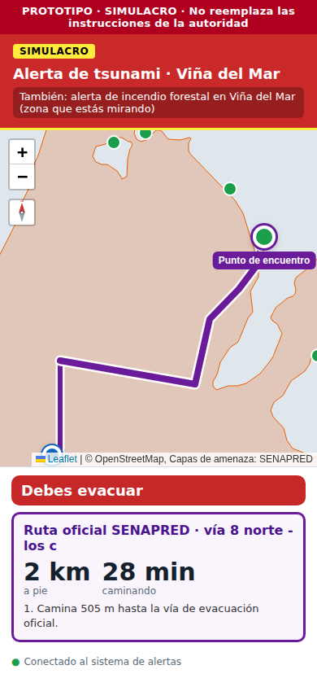
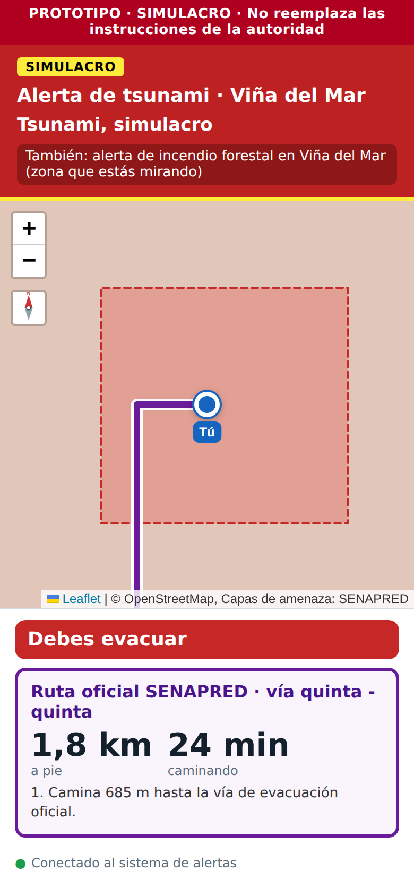

# Reporte 05: Incendio forestal en Viña y varias alertas a la vez

**Fecha:** 2 de octubre de 2026 · **Spec:** §4, §5.2, §5.3 y §10 punto 7 · **Plan:** `PLAN_ZONAS.md` ítem 2 · **Estado:** hecho (falta descargar la capa oficial)

## Qué se hizo

1. **Viña del Mar ya tiene una segunda amenaza con mapa: incendio forestal.**
   - Se usa la capa oficial **Amenaza por Incendio Forestal 2024** de SENAPRED: densidad de incendios forestales 2020–2024, clasificada por **recurrencia** (Muy baja, Baja, Media, Alta, Muy alta).
   - Esa capa mide **dónde hubo incendios**, no un área que haya que evacuar. Por eso se muestra **solo como referencia**: nunca dice "debes evacuar".
   - En una emergencia, el **operador dibuja el área afectada** por el incendio y los puntos de encuentro. Desde ahí funciona igual que el resto: diagnóstico, ruta y validación.
2. **Varias alertas en la misma zona.** Si hay alerta de tsunami y de incendio en Viña a la vez, la ruta **ya no puede llevar de un peligro a otro**.
3. **El script de descarga quedó genérico.** Cada escenario declara su servicio, sus capas y su fuente. Sirve igual para Pucón (volcánica) más adelante.

## Cómo lo ve la persona

**Modo informativo (elegir "Incendio forestal" en Viña):**

- El mapa se colorea de amarillo a rojo según la recurrencia de incendios, con su leyenda por clase.
- El estado dice **"Sin área de evacuación oficial"** y explica: *"El mapa muestra dónde hubo incendios forestales entre 2020 y 2024 (SENAPRED). No es un área de evacuación: en una emergencia, el operador marcará la zona afectada."*
- Debajo, el dato del lugar donde está el pin: *"Recurrencia de incendios forestales 2020–2024 en este punto: **Alta**."* Cambia al mover el pin.
- Al tocar un polígono se ve su recurrencia y la fuente.

**Alerta de incendio forestal:**

| Situación | Qué muestra la app |
| --- | --- |
| El operador aún no marca el área | Modo precaución: las 3 indicaciones "durante" oficiales |
| La persona está dentro del área marcada | "Debes evacuar" + ruta sugerida por calles al punto de encuentro que marcó el operador (o la ruta del operador, si dibujó una) |
| La persona está fuera del área | "Estás en zona segura: permanece aquí" (regla general de la spec §5.3) |

**Alerta de tsunami + alerta de incendio en Viña:**

- El banner muestra la alerta principal y "También: alerta de incendio forestal".
- El mapa de emergencia muestra el área de inundación **y** el área del incendio.
- Si el incendio corta la vía oficial que la app habría usado, la app elige **otra vía** sola. En la prueba, la ruta cambió de la vía "quinta - quinta" a la vía "8 norte - los c…", que no toca el incendio.
- Si la persona está dentro del incendio aunque esté fuera del área de inundación, la app dice **"Debes evacuar"** igual.

| Incendio sobre la vía: la ruta cambia de vía | Dentro del incendio y del área de tsunami |
| --- | --- |
|  |  |

*Capturas con servicios simulados: el fondo de calles no carga en el entorno de prueba y el tramo por calles es un camino de prueba.*

## Decisiones

- **La capa 2024 va como referencia, no como área de peligro.** Si se usara como área, la app diría "debes evacuar" en sectores enormes solo porque ahí hubo incendios antes. Esto confirma lo que ya decía `PLAN_ZONAS.md`.
- **Regla "sale y no vuelve a entrar", área por área.** Antes se medía contra la unión de todas las áreas. Así, una ruta que dentro del área de inundación pasaba por el incendio no se detectaba. Ahora entrar a cualquier área cuenta, aunque la persona siga dentro de otra.
- **Áreas de otra alerta:** una ruta no puede ni tocarlas si la persona no está dentro. Se revisa también entre vértices, porque un incendio chico puede quedar entre dos vértices de una vía.
- **Textos:** el área de los incendios se llama "zona afectada por el incendio" (antes decía "la área afectada", que está mal escrito).
- **Colores:** escala amarillo → rojo de 5 clases (ColorBrewer YlOrRd), semitransparente y sin borde, para no confundirla con el área de peligro del operador (roja con borde punteado).

## Pruebas realizadas (Supabase, rutas y capa simulados)

1. Informativo, incendio forestal en Viña: leyenda con 5 clases, fuente "SENAPRED — Amenaza por Incendio Forestal 2024", recurrencia en el pin (cambia de "Muy baja" a "Baja" al mover el pin), popup con la recurrencia.
2. Alerta de incendio con área y punto de encuentro del operador: "Debes evacuar" y "Ruta sugerida a punto de encuentro Plaza de prueba".
3. Tsunami + incendio, con el incendio sobre la vía elegida: la ruta pasó a otra vía que no toca el incendio.
4. Pin en un cerro dentro de un incendio y fuera del área de tsunami: "Debes evacuar (alerta de incendio forestal)".
5. Al cancelar la alerta de incendio, la ruta de tsunami volvió a la vía original. Al cancelar todas, volvió al modo informativo sin ruta.
6. App operador: muestra la capa de recurrencia con sus colores al elegir Viña › Incendio forestal.

## Pendiente

- **Julián:** correr `node scripts/descargar_capas.mjs vina/incendio_forestal` en su PC y revisar el tamaño en `app/data/vina/incendio_forestal/metadata.json` (la capa se recorta al recuadro de Viña y se simplifica unos 5 m). La prueba se hizo con una capa simulada.
- **Equipo:** para la demo de O5, dibujar en el operador un área de incendio de simulacro (fuente "Simulacro del equipo", vigencia 2 h) y al menos un punto de encuentro con amenaza "Incendio forestal". Sin punto de encuentro del operador, la alerta de incendio queda en modo precaución.
- **Idea:** en el operador, mostrar tenues las vías de tsunami cuando se dibuja un incendio, para ver qué vía corta. Hoy hay que cambiar la amenaza a tsunami para verlas.
