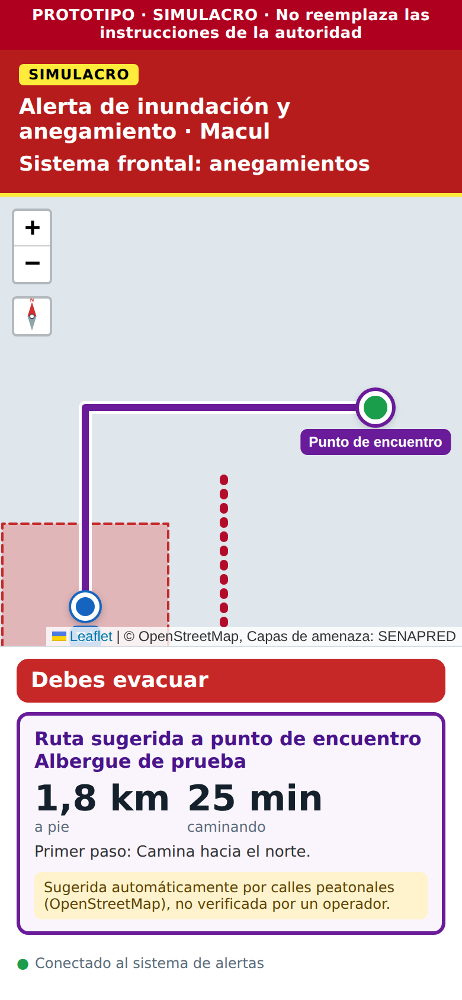

# Reporte 06: Macul (inundación y anegamiento, incendio estructural)

**Fecha:** 2 de octubre de 2026 · **Spec:** §4, §5.1, §6 · **Plan:** `PLAN_ZONAS.md` ítems 3 y 4 · **Estado:** hecho (falta descargar límite y puntos, y volver a desplegar la función `rutas`)

## Qué se hizo

1. **Nueva zona: Macul, la comuna completa.**
   - Su cobertura es el **límite comunal oficial** (División Político Administrativa, SUBDERE, IGM e INE, 2018).
   - Tiene dos amenazas: **Inundación y anegamiento** e **Incendio estructural**.
   - Es la zona pensada para la entrevista con la Dirección de Gestión del Riesgo de Macul.
2. **Puntos críticos oficiales de Macul.**
   - El plan suponía que no había datos públicos, pero SENAPRED (ex ONEMI) publica los **31 puntos críticos ante lluvias** que la Municipalidad de Macul informó en el *Programa Invierno 2022*.
   - La mayoría son por "colapso de colectores de aguas lluvia/alcantarillados", con nivel de riesgo bajo o medio. Uno está en el **Campus San Joaquín (DICTUC)**, con nivel alto, y otro es el **desborde del Zanjón de la Aguada**.
   - Se muestran como **referencia**, coloreados por nivel de riesgo, porque no son un área a evacuar.
3. **Contenido oficial de inundación**, con citas de SENAPRED y MINSAL. En Macul se agrega la **central municipal 1444**, también en incendio estructural.
4. **Las rutas por calles ahora esquivan los tramos bloqueados** marcados por el operador (calles anegadas) y las áreas de otras alertas.
5. **Zonas una dentro de otra.** El Campus está dentro de Macul y se resolvió sin escribir nada específico para esas dos zonas en el código.

## Cómo lo ve la persona

**Modo informativo, Macul › Inundación y anegamiento:**

- Mapa con los puntos críticos coloreados por nivel de riesgo (Alto, Medio, Bajo). Al tocarlos se ven la causa y el nivel de riesgo.
- El estado dice "Sin área de evacuación oficial" y explica qué muestra el mapa y que los datos son de 2022.
- Debajo, el punto crítico más cercano al pin. Ejemplo: *"Punto crítico más cercano: **Av Macul / Victo Domingo Silva**, a 410 m (colapso colectores de aguas lluvia/alcantarillados)."*
- El panel Información tiene antes, durante y después. "Durante" tiene 3 frases:
  - No camines ni conduzcas por calles anegadas.
  - Aléjate de canales y quebradas.
  - Corta la luz, el gas y el agua si el agua entra a la casa.

**Alerta de inundación en Macul:**

| Situación | Qué muestra la app |
| --- | --- |
| El operador aún no marca nada | Modo precaución: las 3 frases "durante" |
| Hay un sector afectado marcado y la persona está dentro | "Debes evacuar" + ruta por calles al albergue que marcó el operador, **esquivando las calles cortadas** |
| La persona está fuera del sector marcado | "Estás en zona segura: permanece aquí" |

*Captura con servicios simulados: sector anegado (rojo punteado), calle cortada (línea roja de puntos) y ruta sugerida que la rodea hasta el albergue.*

**El Campus y Macul:**

| Dónde está la persona | Alerta de Macul | Alerta del Campus |
| --- | --- | --- |
| En el Campus | Le llega | Le llega |
| En otra parte de Macul | Le llega | No le llega |

- El pin muestra la zona más pequeña: en el Campus se ve el Campus.
- Durante una alerta de Macul, la app se queda en Macul aunque la persona se mueva dentro del Campus.

## Decisiones

- **Puntos críticos 2022 como referencia, no como bloqueos ni áreas.** Muestran dónde hubo problemas, no dónde los hay hoy. En una emergencia, el operador marca lo que está pasando: calles cortadas, sector afectado y albergues.
- **No se guarda el nombre del funcionario** que aparece en la capa oficial (campo `responsabl`). No aporta y es un dato personal.
- **Límite comunal desde el servicio del MOP** (datos SUBDERE). Es la fuente oficial de límites. El servicio solo entrega el formato de Esri, así que el script lo convierte.
- **Esquivar con `avoid_polygons`** (lo permitía la spec §6). Se esquivan los bloqueos (con un margen de 8 m) y las áreas de otras alertas. No se esquiva el área de la amenaza principal: la persona suele estar dentro y ORS no encontraría ruta. Si ORS no encuentra ruta esquivando, se reintenta sin esquivar y la validación descarta lo que cruce un bloqueo.
- **Mensajes claros:** si todas las rutas cruzan un bloqueo, la tarjeta lo dice en vez de "vuelven a entrar al área". Un error 404 de ORS ("no hay ruta") ya no se confunde con "falta desplegar la función".

## Pruebas realizadas (Supabase, rutas, límite y puntos simulados)

1. Sin el archivo de límite comunal, Macul no aparece y la app funciona igual, con un aviso en la consola.
2. Macul › Inundación: leyenda con las clases presentes (Alto, Medio, Bajo), fuente SENAPRED 2022, punto crítico más cercano y popup con la causa. Incendio estructural muestra la central 1444.
3. Pin en el Campus: la app cambia al Campus.
4. Alerta de inundación en Macul con el pin en el Campus: llega, la app pasa a Macul y se queda en Macul al mover el pin dentro del Campus.
5. Sector anegado + albergue + calle cortada: "Debes evacuar" y ruta sugerida al albergue. El pedido de ruta incluyó los polígonos a esquivar.
6. Una alerta del Campus no le llega a quien tiene el pin en otra parte de Macul, y sí a quien está en el Campus.
7. App operador: Macul aparece en alertas y en dibujo, con sus dos amenazas.
8. Regresión de Viña: con tsunami + incendio, la ruta sigue cambiando de vía.

## Pendiente

- **Julián, en su PC:**
  1. `node scripts/descargar_capas.mjs macul/cobertura`
  2. `node scripts/descargar_capas.mjs macul/inundacion` (debe decir 31 elementos)
  3. Volver a desplegar la Edge Function `rutas` con el nuevo `supabase/functions/rutas/index.ts`, para esquivar bloqueos. La versión anterior sigue funcionando, pero no esquiva.
- **Equipo, para la demo:** en el operador, Macul › Inundación: dibujar un sector anegado (área de peligro), calles cortadas (bloqueo) y un albergue o punto de encuentro (amenaza "Todas"), con fuente "Simulacro del equipo".
- **Entrevista con Macul:** pedir los **puntos críticos actualizados** (los oficiales son de 2022), los albergues y quién sería el operador.
