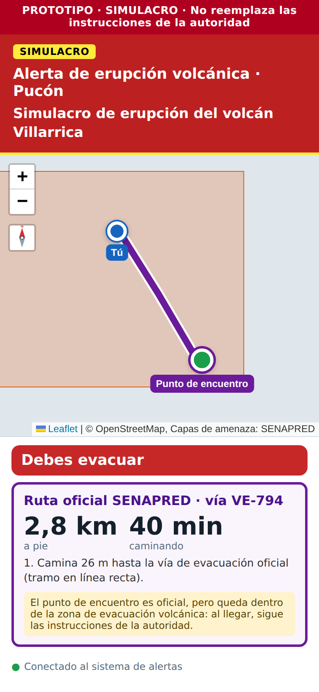

# Reporte 07: Pucón (erupción volcánica e incendio forestal)

**Fecha:** 2 de octubre de 2026 · **Spec:** §4, §5.2, §6 · **Plan:** `PLAN_ZONAS.md` ítem 5 · **Estado:** hecho (falta descargar los datos)

## Qué se hizo

**Pucón es la zona 3.** Cumple el criterio de la spec: tiene más de una amenaza, distintas del tsunami, y bastante información oficial.

1. **Erupción volcánica (volcán Villarrica)**, con datos oficiales de SENAPRED:
   - **Área de evacuación** del volcán: se usa como área de peligro y para el diagnóstico.
   - **Vías de evacuación**: 3 en Pucón (VE-787, VE-793 y VE-794).
   - **Puntos de encuentro transitorios (PET)**: Península Pucón, Los Calabozos, Quelhue y otros.
   - **Zonas de peligro alto, medio y bajo**: se usan como referencia.
   - **El volcán**, con su peligrosidad: "Muy Alta".
2. **Incendio forestal**: la misma capa oficial de 2024 que en Viña, como referencia.
3. **Contenido oficial de erupción volcánica**, de SENAPRED y MINSAL. Pucón agrega dos datos de su **Plan Comunal de Emergencia**:
   - Bomberos alerta con 5 toques de sirena y perifoneo.
   - En una emergencia volcánica hay puestos médicos en los PET de Quelhue, la Península y Los Calabozos.
4. **El límite comunal oficial** como cobertura, igual que Macul.

## Cómo lo ve la persona

**Modo informativo:**

- El pin parte en el centro de Pucón, al inicio de la vía oficial VE-787.
- El estado dice "Estás en la zona de evacuación volcánica".
- Debajo aparece el dato del lugar: *"Peligro volcánico en este punto: Alto"*.
- El mapa muestra el área de evacuación, las vías, los PET y el volcán. La capa de peligro alto/medio/bajo viene apagada para no recargar el mapa; se enciende en el control de capas.

**Alerta volcánica:**

| Dónde está la persona | Qué ruta muestra la app |
| --- | --- |
| En el centro de Pucón | Ruta oficial por la vía VE-787 hasta el PET Península Pucón |
| Cerca del inicio de VE-794 | Ruta oficial por la vía VE-794 hasta el PET Los Calabozos, con el aviso: *"El punto de encuentro es oficial, pero queda dentro de la zona de evacuación volcánica: al llegar, sigue las instrucciones de la autoridad."* |
| Cerca del inicio de VE-794, si el operador desactiva esa vía | Otra opción: ruta sugerida por calles a la Península |

*Captura con datos simulados: solo los inicios y finales de las vías son los oficiales.*

## Hallazgos y decisiones

- **Las vías tienen un solo sentido.** Las 8 vías del Villarrica dicen "bidireccional: no". Se revisaron sus extremos: las de Pucón terminan en los PET. VE-794 avanza hacia el volcán, pero termina en Los Calabozos, que es un punto oficial. Por eso **no** se reordenaron con una regla del tipo "alejarse del volcán": se respeta el sentido oficial.
- **Algunos PET quedan dentro del área de evacuación.** Los Calabozos y Quelhue quedan dentro del área de evacuación oficial, pero SENAPRED los publica como puntos de encuentro y el Plan Comunal de Pucón pone puestos médicos ahí.
  - Antes, la app descartaba cualquier destino dentro de un área de peligro, así que habría ignorado esos puntos.
  - Ahora el catálogo los marca con `destino_aunque_dentro`: siguen siendo destinos, y la tarjeta avisa que el punto queda dentro del área.
  - Un punto dentro del área de **otra** alerta nunca es destino.
- **Las zonas de peligro alto, medio y bajo son solo referencia.** Si fueran área de peligro, la app diría "debes evacuar" en zonas enormes. La capa oficial no dice a qué volcán pertenece cada zona, así que se filtra por el recuadro de Pucón: son 120 polígonos.
- **Las vías no traen código.** La app arma "VE-787" desde su `objectid`. Ese código sirve para la tarjeta de ruta y para que el operador desactive una vía.
- **El dato de una capa de referencia en el punto** (peligro volcánico, recurrencia de incendios) ahora aparece también cuando hay área de peligro. Antes solo aparecía en zonas sin área.

## Pruebas realizadas (Supabase, rutas y capas simuladas)

1. Pucón aparece en el selector, con "Erupción volcánica" e "Incendio forestal".
2. Informativo:
   - Estado "Estás en la zona de evacuación volcánica" + "Peligro volcánico en este punto: Alto".
   - Leyenda por clase y fuente SENAPRED 2026-09-21.
   - Popup del volcán: "Villarrica · Peligrosidad: Muy Alta".
   - El panel Información trae la sirena de 5 toques.
3. Fuera del área: "Fuera de la zona de peligro". Incendio forestal: recurrencia en el pin.
4. Alerta desde el centro: VE-787 hasta la Península. Desde el inicio de VE-794: VE-794 hasta Los Calabozos, con el aviso del punto dentro del área.
5. El operador desactiva VE-794 y la ruta cambia sola a la Península.
6. Regresión con los datos **reales** ya descargados: Macul (31 puntos críticos, límite comunal) y Viña (tsunami e incendio forestal) siguen funcionando.

## Pendiente

- **Julián, en su PC:**
  1. `node scripts/descargar_capas.mjs pucon/cobertura`
  2. `node scripts/descargar_capas.mjs pucon/volcanica`: el área de evacuación y el peligro se recortan al recuadro de Pucón. Revisa el tamaño en `metadata.json`: si pasa de ~1 MB, se puede simplificar más.
  3. `node scripts/descargar_capas.mjs pucon/incendio_forestal`
- **Verificar con los datos reales** que VE-794 termine a menos de 150 m de Los Calabozos. Si no, la app no la ofrecerá.
- **Equipo:** decidir si Pucón entra a la 2ª ronda de testeo. Para O4 sirve, porque el Visor Chile Preparado muestra las mismas capas volcánicas.
