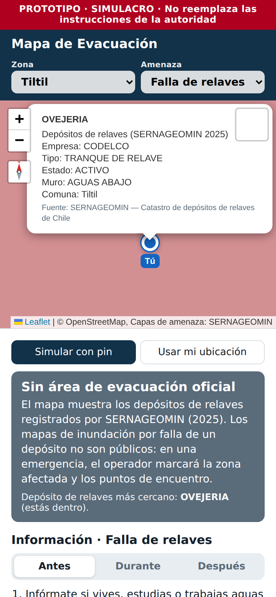
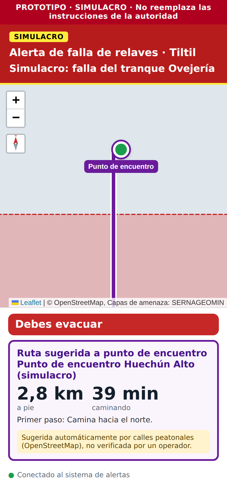

# Reporte 08: Tiltil (falla de relaves, incendio forestal, inundación)

**Fecha:** 2 de octubre de 2026 · **Spec:** §4, Anexo A · **Plan:** `PLAN_ZONAS.md` ítem 7 · **Estado:** hecho (falta descargar los datos)

## Por qué Tiltil

- **Caso B2B del proyecto.** Tiltil tiene el tranque **Ovejería** (Codelco Andina) y limita con el tranque **Las Tórtolas** (Anglo American, en Colina). Ambos están clasificados como de consecuencia **"Extrema"** en sus divulgaciones GISTM.
- **El cliente sería la minera, actuando como operador.** Los mapas de inundación por falla y las zonas seguras están en el plan de emergencia de cada empresa y no son públicos.
- **La comuna también tiene incendios forestales con evacuaciones ordenadas por SENAPRED:**
  - 25-dic-2024: Santa Matilde, Quilapilún y Quilapilún Bajo, con más de 950 ha.
  - 22-nov-2025: alerta roja y mensaje SAE.
- **Tiene 48 puntos críticos ante lluvias** (2022).

## Qué se hizo (iteración 2)

| Amenaza | Capa oficial | Rol |
| --- | --- | --- |
| **Falla de relaves** (nueva) | SERNAGEOMIN, *Catastro de depósitos de relaves* (actualizado a octubre de 2025): 11 depósitos en el recuadro | `referencia`, coloreada por estado (activo, inactivo, abandonado) |
| Incendio forestal | SENAPRED, *Amenaza por Incendio Forestal 2024* (46 polígonos) | `referencia`, igual que Viña y Pucón |
| Inundación y anegamiento | SENAPRED, *Puntos Críticos Programa Invierno 2022* (48 puntos de Tiltil) | `referencia`, igual que Macul |

**Otros cambios:**
- **Cobertura:** el límite comunal oficial (SUBDERE/IGM/INE 2018).
- **Punto de partida del pin:** el centro de Tiltil (Manuel Rodríguez con Daniel Moya).
- **Información "Falla de relaves":**
  - Antes, durante y después, desde MINSAL (aluviones) y SERNAGEOMIN.
  - Para Tiltil se agregan dos datos: los poblados cercanos a Ovejería (Codelco) y los simulacros de Las Tórtolas (Municipalidades de Tiltil y Colina).
- **Diagnóstico:** muestra el **depósito más cercano** al pin y su estado. Por ejemplo, desde Huechún: *"Depósito de relaves más cercano: OVEJERIA, a 1,8 km (activo)"*.
- **Popup:** al tocar un depósito se ven su nombre, empresa, tipo, estado, muro y comuna.

| Modo informativo, pin sobre Ovejería | Alerta de simulacro con área y punto del operador |
| --- | --- |
|  |  |

*Capturas con datos simulados: depósitos como cuadrados en la posición real y área de inundación inventada solo para la prueba.*

## Cómo funciona en una emergencia

1. La minera o el municipio envía la **alerta "Falla de relaves"** para Tiltil.
2. **Sin nada dibujado:** modo precaución. Dice "Sin área de peligro marcada" y muestra las 3 frases oficiales "durante".
3. **El operador dibuja la zona de inundación del plan de emergencia como área de peligro, y los puntos de encuentro.** Siempre con fuente, por ejemplo "PPRE Tranque Ovejería, Codelco". Entonces:
   - quien está dentro del área ve "Debes evacuar" y una ruta por calles al punto de encuentro;
   - quien está fuera del área ve "Estás en zona segura".
4. **Si hay incendio y relaves a la vez**, la ruta se valida contra las dos áreas, como en Viña.

## Hallazgos (iteración 1, investigación)

- **Hay una fuente más nueva para los depósitos.** El plan citaba la capa de la SMA (datos 2019). SERNAGEOMIN publica `CDR_CHILE_AREAL_2025` y `CDR_CHILE_PUNTUAL_2025`, que alimentan la *Plataforma Pública de Relaves*. Se usa la de 2025.
- **Depósitos en Tiltil (SERNAGEOMIN 2025):**
  - Ovejería (Codelco, tranque activo, muro aguas abajo).
  - Minera San Pedro (embalse y filtrado, activos).
  - Cemento Polpaico: tranque 5 activo y tranques 1-4 inactivos.
  - Tres abandonados: Anita 1-2, San Francisco y Nogaz.
  - En el recuadro también entran **Las Tórtolas** (Colina) y **Ramayana 1 y 2** (Olmué, abandonados).
- **No hay mapa de inundación público.** Las divulgaciones GISTM de Codelco (2025) y Anglo American (agosto de 2024) no lo publican. Codelco nombra los poblados más cercanos a Ovejería: Huechún, Santa Matilde y Huertos Familiares, a menos de 10 km.
- **No hay guía oficial de qué hacer ante la falla de un relave.** Se revisaron SENAPRED, SERNAGEOMIN y MINSAL. Una falla genera un **flujo de barro**, así que se usaron las recomendaciones oficiales de **MINSAL para aluviones**. La decisión quedó anotada en `relave.json` (`_nota`). **Hay que validarla con SENAPRED o con la minera.**
- **Simulacros reales en la zona:**
  - Las Tórtolas, 21-nov-2024: Huertos Familiares, Huechún, Santa Matilde, Los Lingues y Quilapilún Bajo, con zonas seguras señalizadas.
  - Las Tórtolas, 1-nov-2025: El Colorado (Colina) y Punta Peuco (Tiltil), con SENAPRED y SERNAGEOMIN.
  - Ovejería, 11-oct-2023: con la comunidad de Huechún.
- **Los puntos críticos 2022 de Tiltil incluyen los dos tranques:** "Tranque de relave Ovejeria, CODELCO" y "Muro Oeste del Tranque Relave Las Tortolas", ambos con nivel Alto. Muchos otros puntos están marcados como "Solucionado".
- **Teléfonos de emergencia municipales:** no se encontró una fuente municipal oficial, así que no se incluyeron. La app sigue mostrando los números nacionales del contenido (Bomberos 132, Carabineros 133).

## Revisión de coherencia (iteración 3)

- **Mismo patrón que el resto:**
  - capas oficiales de referencia con su aviso, y área de peligro solo oficial o del operador (nunca inventada);
  - contenido con citas y "durante" de 3 frases;
  - cobertura desde un límite comunal oficial;
  - escenarios del script como en Macul y Pucón.
- **Ajustes hechos en esta revisión:**
  - Nombre corto "Falla de relaves", porque "Falla de depósito de relaves" se cortaba en el desplegable del celular.
  - El detalle del diagnóstico muestra el **estado** del depósito en vez del nombre del productor, que a veces es una persona natural, por coherencia con lo decidido en Macul.
  - El popup se titula con el nombre de la instalación (campo `titulo` del catálogo).
  - Los contornos de los depósitos se dibujan sin guiones.
  - Se sacaron de la especificación las superficies y volúmenes: el servicio entrega áreas en una proyección que las agranda.
- **Regresión con datos reales:**
  - Pucón: ruta oficial VE-787 hasta la Península.
  - Macul: punto crítico más cercano.
  - Viña: tsunami e incendio forestal.

## Pendiente

- **Julián, en su PC:**
  ```
  node scripts/descargar_capas.mjs tiltil/cobertura
  node scripts/descargar_capas.mjs tiltil/relave
  node scripts/descargar_capas.mjs tiltil/incendio_forestal
  node scripts/descargar_capas.mjs tiltil/inundacion
  ```
  Deben salir 11 depósitos y 48 puntos críticos.
- **Validar el contenido "Falla de relaves"** con SENAPRED (Dirección Regional Metropolitana) o con la minera. Pedirles el PPRE (Plan de Preparación y Respuesta ante Emergencias) con su zona de inundación, puntos de encuentro y sistema de alerta, y permiso para publicarlos como operador.
- **Cobertura:** Las Tórtolas afecta también a sectores de **Colina** (El Colorado, Quilapilún). Si la minera es el cliente, su zona debería ser el área de influencia del tranque y no una comuna. El catálogo ya lo permite: la cobertura puede ser cualquier polígono.
