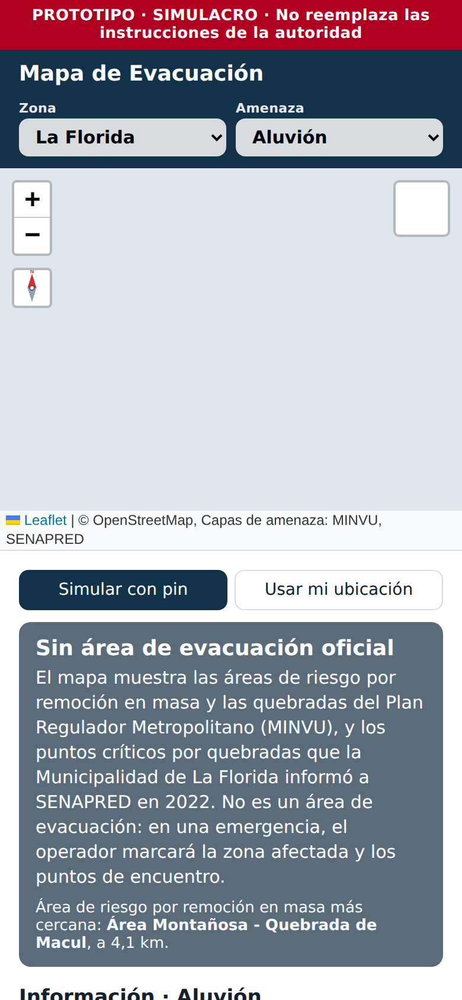
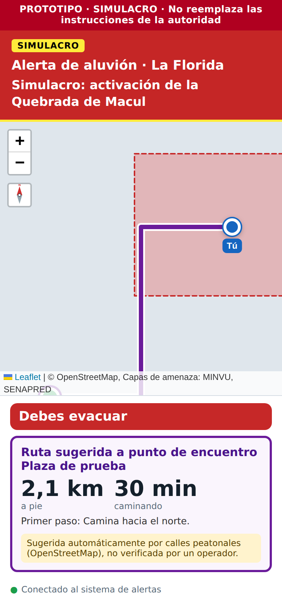

# Reporte 09: Peñalolén y La Florida (aluvión, incendio forestal, inundación)

**Fecha:** 2 de octubre de 2026 · **Spec:** §4, Anexo A · **Plan:** `PLAN_ZONAS.md` ítems 9 y 10 · **Estado:** hecho (falta descargar los datos)

## Qué se hizo

Son **dos zonas separadas**, cada una con su límite comunal oficial, y las dos tienen las mismas tres amenazas:

| Amenaza | Capas oficiales (como referencia) |
| --- | --- |
| **Aluvión** (nueva) | MINVU, *Plan Regulador Metropolitano de Santiago (PRMS)*: áreas de riesgo por remoción en masa, áreas de riesgo por derrumbes y quebradas. SENAPRED: puntos críticos 2022 por quebradas y aluviones |
| Incendio forestal | SENAPRED, *Amenaza por Incendio Forestal 2024* |
| Inundación y anegamiento | SENAPRED, *Puntos Críticos Programa Invierno 2022* (todos los de la comuna) |

- **Punto de partida del pin:**
  - Peñalolén: El Valle con Sánchez Fontecilla.
  - La Florida: Av. La Florida con Walker Martínez.
- **Contenido "Aluvión":** viene de la página oficial de SENAPRED (señales y qué hacer) y de MINSAL.
  - "Antes" enseña las señales: lluvia fuerte y sostenida, más calor de lo normal en la cordillera, agua turbia, cambios bruscos del caudal y un ruido como de camiones.
  - Las dos zonas agregan un dato: el aluvión de la Quebrada de Macul del 3 de mayo de 1993, que dejó 26 fallecidos (BCN), y las piscinas antialuviones construidas después (Gobierno de Santiago).
  - Peñalolén agrega además: en julio de 2026 el municipio identificó 10 puntos críticos y revisó esas piscinas con el Gobierno de Santiago.
- **Diagnóstico:** muestra el área de riesgo del PRMS más cercana, por ejemplo: *"Área de riesgo por remoción en masa más cercana: Área Montañosa – Quebrada de Macul, a 4,1 km"*.

| Modo informativo (La Florida) | Alerta de simulacro con área y punto del operador |
| --- | --- |
|  |  |

*Capturas con datos simulados: el fondo de calles no carga en el entorno de prueba.*

## Hallazgos

- **No hay un mapa vectorial oficial de peligro de aluvión.**
  - Los mapas de SERNAGEOMIN (peligros geológicos de Santiago, 2016; flujos del 3 de mayo de 1993) están en PDF o son de pago.
  - Su servidor de mapas no respondió.
  - Las capas de ArcGIS Online sobre la Quebrada de Macul encontradas son de terceros no oficiales: no se usaron.
- **El PRMS sí está publicado por MINVU** (Centro de Estudios). En el oriente de Santiago tiene:
  - **Riesgo por remoción en masa:** Quebrada de Macul (Peñalolén–La Florida), Lo Cañas (La Florida), O-16 (La Reina–Peñalolén) y Quebrada de Ramón (Las Condes).
  - **Riesgo por derrumbes:** Quebrada Macul–Canal Las Perdices.
  - **Quebradas:** Macul, Lo Hermida, Las Perdices, Lo Cañas, Nido de Águila, Las Vizcachas y otras.
- **Puntos críticos 2022 por quebradas, la mayoría con nivel "Muy Alto":**
  - **Peñalolén:** Quebrada de Macul, Lo Hermida, Las Palmas y Caballero de la Montaña.
  - **La Florida:** las quebradas O-7 a O-11, además de los campamentos Dignidad, Santa Luisa y Quebrada de Macul 2, y la zona de exclusión de la Población La Higuera.
- **SENAPRED declaró Alerta Temprana Preventiva por aluviones en las dos comunas** el 8-jul-2026. En enero de 2021, la activación de la Quebrada de Macul obligó a evacuar el Campamento Dignidad (alerta amarilla de la ex ONEMI). Son buenos escenarios para un simulacro.
- **Los 18 puntos críticos por comuna del Gobierno de Santiago** (julio de 2026) están en un Excel sin coordenadas listas para usar: no se cargaron. Los puntos 2022 de SENAPRED cubren las mismas quebradas.

## Decisiones

- **El PRMS va como referencia, no como área de peligro.** Es un instrumento de planificación (dónde no construir), no un área a evacuar. Si fuera área de peligro, la app diría "debes evacuar" a gente que no corre riesgo inmediato.
- **Los puntos críticos aparecen en dos amenazas, filtrados distinto:**
  - en **Aluvión**, solo las causas de quebrada: aluvión, deslizamiento y activación de quebradas;
  - en **Inundación**, todos.
- **Las dos comunas comparten la Quebrada de Macul.** Cada zona descarga su recuadro, así que el área de la quebrada aparece en las dos.
- **Coherencia con Tiltil:** el contenido de "Falla de relaves" ahora también cita la página de aluviones de SENAPRED, porque las acciones son las mismas.
- **Popups:** las quebradas sin nombre ya no muestran un título vacío ni filas en blanco.

## Pruebas realizadas (Supabase, rutas y capas simuladas)

1. Las dos zonas aparecen en el selector, cada una con "Aluvión | Incendio forestal | Inundación y anegamiento".
2. En las dos:
   - estado "Sin área de evacuación oficial" con el aviso del PRMS;
   - área de riesgo más cercana y leyenda;
   - fuentes MINVU y SENAPRED;
   - el panel Información trae el aluvión de 1993, y en Peñalolén también los 10 puntos críticos de julio de 2026;
   - popups del PRMS y de las quebradas.
3. Inundación: punto crítico más cercano con el nombre del municipio correcto. Incendio forestal: recurrencia en el pin.
4. La Florida, pin en el Campamento Dignidad:
   - alerta de aluvión sin nada dibujado: modo precaución con las 3 frases de SENAPRED;
   - con un área y un punto del operador: "Debes evacuar" y ruta sugerida.
5. Regresión con los datos **reales** de Tiltil (11 depósitos): depósito más cercano y leyenda por estado.

## Pendiente

- **Julián, en su PC:**
  ```
  node scripts/descargar_capas.mjs penalolen/cobertura
  node scripts/descargar_capas.mjs penalolen/aluvion
  node scripts/descargar_capas.mjs penalolen/incendio_forestal
  node scripts/descargar_capas.mjs penalolen/inundacion
  node scripts/descargar_capas.mjs la_florida/cobertura
  node scripts/descargar_capas.mjs la_florida/aluvion
  node scripts/descargar_capas.mjs la_florida/incendio_forestal
  node scripts/descargar_capas.mjs la_florida/inundacion
  ```
- **Si los municipios se interesan, pedirles:**
  - el anexo de remoción en masa de su Plan Comunal de Emergencia;
  - los puntos de encuentro y zonas seguras ante aluvión;
  - los puntos críticos actualizados.
- **Si alguien compra o consigue el mapa de peligros de SERNAGEOMIN** (2016), usarlo como referencia, siempre citado.
